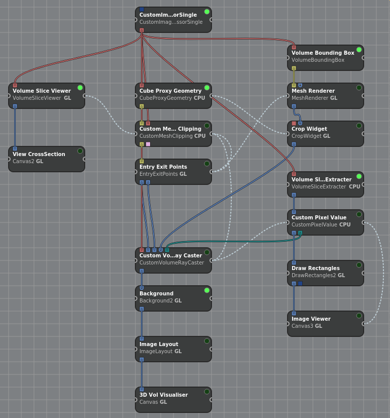

# About

This repository contains the workspace files for the project : [3D-Histopathology using Inviwo and Openslide](https://github.com/agam-kashyap/3Dhistopathology)

As explained in the [documentation](https://agam-kashyap.notion.site/3D-Histopathology-using-Inviwo-and-OpenSlide-253b21f7f66a47e786ab83b2630f23d8), all of the features are present in both the workspaces with the difference only being in the *zoom feature*. 

**rec-select-multi.inv** : This workspace showcases the method of drawing rectangular region to view a higher resolution image of that region.

**single-img-level.inv** : This workspace showcases zooming and changing the coordinates for viewing different regions.

